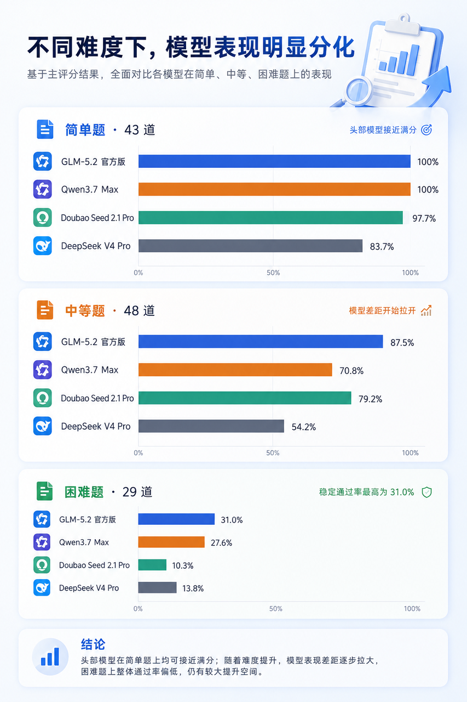

# 四模型对比结果

下表使用相同题包和评分规则。GLM、Doubao、DeepSeek 采用主运行结果；Qwen3.7 Max 的困难题采用三次运行都通过的稳定交集，其余难度仍采用主运行结果。

| 模型 | 总通过率 | 简单题 | 中等题 | 困难题 | 红线题数 | 运行耗时 |
| --- | --- | --- | --- | --- | --- | --- |
| GLM-5.2 官方版 | 78.33% | 100.00% | 87.50% | 31.03% | 1 | 7m28s |
| Qwen3.7 Max | 70.83% | 100.00% | 70.83% | 27.59% | 2 | 23m34s + 2 次困难题复测 |
| Doubao Seed 2.1 Pro | 69.17% | 97.67% | 79.17% | 10.34% | 4 | 7m15s |
| DeepSeek V4 Pro | 55.00% | 83.72% | 54.17% | 13.79% | 5 | 18m01s |

## 结果说明

- 简单题差距较小，中等题开始出现明显分化。
- 困难题最高通过率为 31.03%，说明跨证据、权限和高风险流程仍是主要瓶颈。
- 结果只反映本题包和本次模型版本，不代表模型的通用能力或其他业务场景表现。
