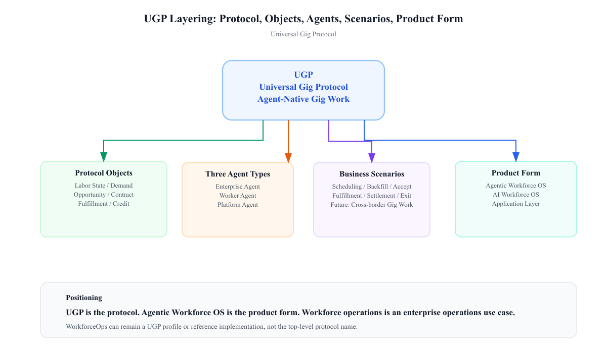

# UGP：通用灵工协议

## 通用灵工协议

UGP（Universal Gig Protocol，通用灵工协议）是面向 AI Agent 时代的开放业务协议。它把企业用工需求、劳动者工作意愿和平台履约能力抽象成一套可发现、可协商、可授权、可履约、可结算、可审计的标准业务语言。

UGP 的目标不是让 Agent “会聊用工”，而是让 Agent 能够围绕实际灵工关系执行可靠动作：发现能力、表达需求、匹配机会、形成承诺、验证履约、处理争议、完成结算，并把履约信用沉淀到下一次流动性循环中。

[English protocol overview](../en/)

## 协议定位

UGP 不是招聘协议，不是岗位发布协议，也不是企业侧运营工具协议。它的协议标的是“灵工关系”。

| 层级 | UGP 中的含义 |
|---|---|
| 协议 | UGP / Universal Gig Protocol / 通用灵工协议 |
| 协议对象 | 人力状态、用工需求、工作机会、工作合约、履约记录、结算信用 |
| Agent 角色 | 企业 Agent、劳动者 Agent、平台 Agent |
| 场景配置 | 企业侧用工管理、劳动者侧工作机会、灵活用工、结算信用、争议处理 |
| 产品形态 | Agentic Workforce OS / AI 用工操作系统 |

WorkforceOps 是 UGP 之上的企业侧与平台履约运营场景配置。它是第一批可落地场景，不是 UGP 的全部边界。

## 为什么需要 UGP

灵工市场的第一性原理是流动性：合适的人、合适的工作、合适的时间、合适的地点和合适的约束，需要快速、可靠、负责任地匹配起来。

传统软件把这个过程拆散在需求、排班、报名、入职、考勤、工时、培训、证件、薪资、账单、开票、争议和信用系统里。进入 Agent 时代，如果没有共同协议，AI 只会把碎片化软件变成碎片化对话。

UGP 让三类 Agent 在同一套语义下协作：

- 企业 Agent 表达用工需求、排班、补人、确认人员、验收履约和处理异常。
- 劳动者 Agent 表达可工作状态、发现机会、确认接单、到岗履约、核对收入和维护信用。
- 平台 Agent 做供需匹配、候补调度、风控识别、履约验真、结算诊断、争议升级和信用沉淀。

## 协议分层

SVG 源文件：[ugp-diagram-1-protocol-layers.svg](../assets/ugp-diagram-1-protocol-layers.svg)

UGP 分为六层：

| 层 | 作用 |
|---|---|
| 场景配置层 | 声明协议版本、场景配置、服务、能力、schema、策略、密钥和一致性声明 |
| 对象层 | 定义六类核心对象，以及证据引用、产物、授权确认、审计事件等支撑对象 |
| 能力层 | 定义可发现、可授权、可审计的业务能力 |
| 策略层 | 定义权限、脱敏、确认、升级、拒绝、授权确认和审计语义 |
| 生命周期层 | 定义 WorkContract 状态机和履约到结算的门控 |
| 传输层 | 绑定到 REST、MCP、A2A、Event 或内部 RPC |

## 核心对象

| 对象 | 含义 |
|---|---|
| `labor_state` | 劳动者的可工作状态、能力、偏好、证件、位置、限制条件和信用状态 |
| `workforce_demand` | 企业或平台的人力需求，包括岗位、班次、规则、技能、预算和履约要求 |
| `work_opportunity` | 劳动者 Agent 可以发现、比较、申请、接受或拒绝的具体工作机会 |
| `work_contract` | 关于时间、地点、薪酬、规则、取消条件、责任主体和确认动作的标准承诺对象 |
| `fulfillment_record` | 到岗、打卡、工时、任务完成、验真、异常、证据和争议事实 |
| `settlement_credit` | 薪资、账单、支付、赔付、扣罚、开票状态、评价和履约信用 |

SVG 源文件：[ugp-rfc-object-lifecycle.svg](../assets/ugp-rfc-object-lifecycle.svg)

## 发现、协商与授权

符合 UGP 的系统应该通过 `/.well-known/ugp` 或等价内部注册表发布场景配置，声明：

- 支持的 UGP 版本；
- 支持的场景配置；
- 服务与传输；
- 能力与 schema；
- 策略、数据分级、授权确认要求；
- 公钥或签名材料；
- 一致性声明。

能力采用反向域名命名。标准能力使用 `org.ugp.*`，扩展能力使用扩展方自己的命名空间，例如 `com.example.staffing.fast_backup_dispatch`。

高风险动作不能从自然语言直接跳到提交。UGP 策略门控必须先给出 `ALLOW`、`MASK_AND_ALLOW`、`ASK_CONFIRMATION`、`ESCALATE` 或 `DENY`。

SVG 源文件：[ugp-rfc-policy-gate.svg](../assets/ugp-rfc-policy-gate.svg)

## 初始场景配置

| 场景配置 | 范围 |
|---|---|
| `org.ugp.core` | 发现、信封、对象引用、策略决策、授权确认、审计事件和通用生命周期语义 |
| `org.ugp.enterprise_operations` | 企业侧与平台用工管理：花名册、需求排班、考勤工时、薪资费用、账单开票、争议合规、评价奖惩 |
| `org.ugp.worker_opportunity` | 劳动者侧工作机会旅程：找活、推荐、接单、到岗、收入核对、争议发起和信用解释 |
| `org.ugp.flex_work` | 兼职、临时、按需、班次制和项目制灵工关系 |
| `org.ugp.settlement` | 薪资、支付、账单、开票、赔付、扣罚、信用更新和对账 |
| `org.ugp.dispute` | 证据包、申诉、争议流转、责任主体升级和处理结果 |

本仓库第一版评测只覆盖 `org.ugp.enterprise_operations` 风格的 企业侧用工管理场景。

全职 HCM 与通用员工全生命周期管理不属于 UGP 核心范围。灵工链路与这些系统交叉时，实现方可以通过厂商扩展完成集成。

## 与 UCP 的关系

UCP 让 Agent 能完成商品交易。UGP 让 Agent 能完成灵工关系。

| 对比项 | UCP | UGP |
|---|---|---|
| 目标关系 | 商品交易 | 灵工关系 |
| 核心对象 | 商品、商家、用户、订单、支付 | 人力状态、用工需求、工作机会、工作合约、履约记录、结算信用 |
| 核心过程 | 发现、购买、支付、订单履约 | 需求、匹配、确认、到岗、履约、结算、信用 |
| 风险重点 | 支付授权、订单真实性、商家履约 | 身份、证件、排班、工时、薪资、赔付、争议、合规 |

UGP 可以复用 A2A、MCP、REST、AP2、DID/W3C VC 和 UCP，但它自己的中心始终是灵工关系。

## 目录

- [中文协议正文](./universal-gig-protocol.md)
- [English protocol](../en/universal-gig-protocol.md)
- [协议示例](../examples/)
- [Schema 目录](../schemas/)
- [协议图](../assets/)

## 评测范围

本仓库的数据集是 UGP 的第一版 WorkforceOps 评测。它基于脱敏后的企业侧用工管理数据，评测 Agent 是否能在花名册、需求排班、考勤工时、薪资费用、培训证件、争议合规、账单开票、评价奖惩等场景中遵守授权、隐私、红线、预期产物和工具调用边界。

它还不覆盖完整劳动者侧工作机会旅程，也不覆盖所有平台结算信用和争议处理场景配置。
