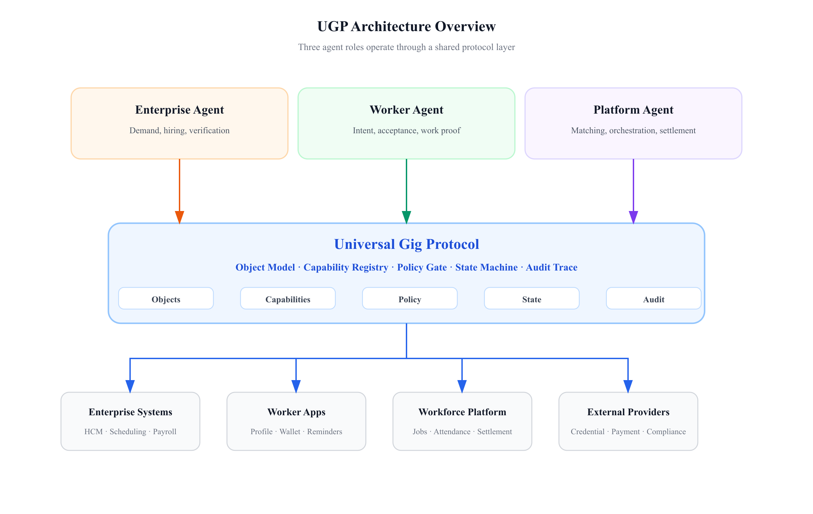
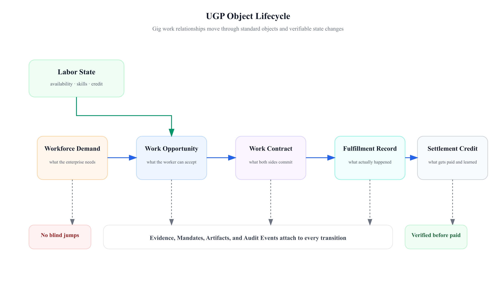
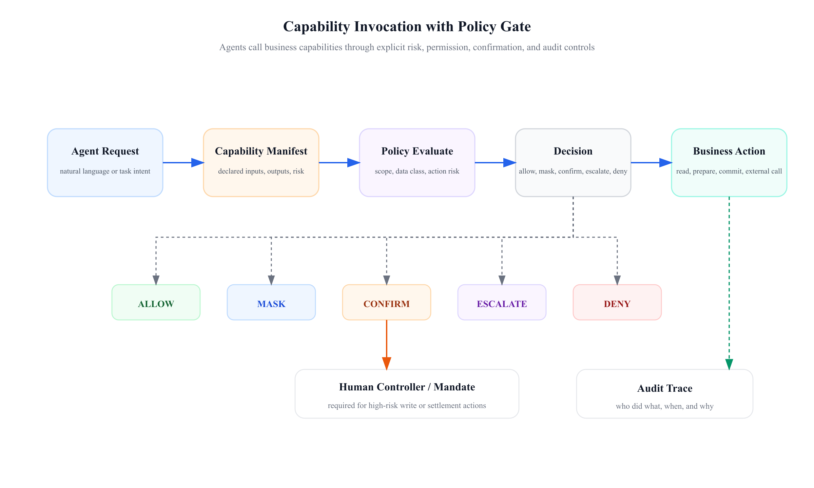

# UGP：通用灵工协议

## 面向 Agent 原生灵工关系的通用灵工协议

## 摘要

UGP（Universal Gig Protocol，通用灵工协议）是面向 AI Agent 时代的开放业务协议。它让企业 Agent、劳动者 Agent 和平台 Agent 能够在跨系统场景中，以统一方式发现用工能力、表达用工需求、描述劳动者意愿、匹配工作机会、形成工作承诺、验证履约事实、处理争议、完成结算，并沉淀履约信用。

UGP 的目标不是让 Agent “会聊用工”，而是定义 Agent 在实际灵工流程中可靠行动所需的对象、能力、权限语义、生命周期状态、证据引用、策略决策和审计事件。

UGP 覆盖兼职、临时、按需、班次制、外包服务、劳务派遣和项目制等灵工安排。全职 HCM 与通用员工全生命周期管理不属于协议核心范围。UGP 不替代法律定性。劳动关系、劳务关系、派遣关系、外包责任、税务处理、保险责任、社保责任、劳动者保护规则和本地合规义务，必须由适用司法辖区、合同、业务规则和责任主体决定。

## 目录

1. [约定](#1-约定)
2. [动机](#2-动机)
3. [范围](#3-范围)
4. [架构](#4-架构)
5. [角色](#5-角色)
6. [发现、治理与协商](#6-发现治理与协商)
7. [场景配置与一致性等级](#7-场景配置与一致性等级)
8. [核心对象模型](#8-核心对象模型)
9. [能力模型](#9-能力模型)
10. [策略、授权确认与审计](#10-策略授权确认与审计)
11. [消息信封与响应契约](#11-消息信封与响应契约)
12. [工作合约生命周期](#12-工作合约生命周期)
13. [Schema 组合与扩展](#13-schema-组合与扩展)
14. [传输绑定](#14-传输绑定)
15. [错误模型](#15-错误模型)
16. [版本与兼容性](#16-版本与兼容性)
17. [安全、隐私与劳动者保护](#17-安全隐私与劳动者保护)
18. [标准能力引用](#18-标准能力引用)
19. [注册表](#19-注册表)
20. [一致性与评测](#20-一致性与评测)
21. [互操作性](#21-互操作性)
22. [术语表](#22-术语表)
23. [附录 A：企业侧用工管理示例](#附录-ab-端用工管理示例)
24. [附录 B：非目标](#附录-b非目标)

## 1. 约定

本文中的 MUST、MUST NOT、REQUIRED、SHALL、SHALL NOT、SHOULD、SHOULD NOT、RECOMMENDED、MAY、OPTIONAL 按常规协议规范含义理解：MUST 表示兼容性要求，SHOULD 表示强烈建议但可以在有明确理由时放宽，MAY 表示可选。

除非特别说明：

- 时间戳使用 RFC 3339 格式。
- 字段名使用 `snake_case`。
- 对象标识是不可解释字符串，SHOULD NOT 暴露原始数据库 ID。
- 金额必须包含明确币种，并使用最小货币单位整数，或使用带币种的十进制字符串。
- 个人身份信息 SHOULD 通过脱敏引用或凭证句柄表达，而不是直接复制到协议消息中。
- 岗位描述、机会描述、评价、聊天和备注中的自然语言文本都属于不可信输入，MUST NOT 覆盖协议策略。

## 2. 动机

灵工市场的第一性原理是流动性。合适的人、合适的工作机会、合适的时间窗口、合适的地点和合适的约束，必须快速、可靠、负责任地匹配起来。

传统灵工与用工软件把这个过程拆在需求创建、排班、报名、入职、考勤、工时确认、培训、证件核验、薪资、账单、开票、争议、评价和信用系统里。过去依赖人工运营弥合这些语义差异。

到了 Agent 时代，这些差异会变成协议差异：

1. **语义不一致**：不同系统对岗位、班次、承诺、到岗、履约、结算和争议的定义不同。
2. **权限不一致**：Agent 缺少共同规则来判断能读什么、能准备什么、能确认什么、何时脱敏、何时升级、何时拒绝。
3. **状态不一致**：从需求到结算的生命周期无法跨系统追踪与审计。
4. **责任不一致**：用工流程涉及法律、合同、资金、安全和劳动者保护责任，这些责任必须绑定到明确主体。
5. **证据不一致**：结算或信用决策如果不能回溯到履约事实和可审计证据，就是不安全的。

UGP 提供 Agent 原生灵工运营的协议层。它让 Agent 共享“灵工关系”的业务语言，而不只是暴露一组私有工具。

## 3. 范围

UGP 是业务语义协议。它不是新的传输协议、支付协议、身份协议、薪资产品、法律分类系统或 Agent 运行时。

UGP 定义：

- Agent 如何发现对端支持的协议版本、场景配置、服务、能力、schema 和策略要求；
- 企业如何表达用工需求；
- 劳动者如何表达工作状态、意愿、可用时间、偏好、凭证和约束；
- 平台如何发布机会，并支持匹配、调度、候补、风险识别和履约运营；
- 工作承诺如何被准备、确认、取消、争议处理和结算；
- 履约事实如何被声明、验证、举证和审计；
- 结算与信用如何被履约记录门控；
- 敏感数据、高风险动作、确认、升级、拒绝和审计语义如何嵌入 Agent 流程。

UGP 不定义：

- 具体 UI 或对话风格；
- 具体 LLM、Agent 框架、规划器、记忆系统或工具运行时；
- 具体 HCM、ATS、排班、考勤、薪资、财务、账单或客服实现；
- 某段关系在法律上属于劳动关系、劳务关系、派遣、外包、承揽还是平台服务；
- 所有实现都必须公开生产数据。

## 4. 架构



SVG 源文件：[ugp-rfc-architecture-overview.svg](../assets/ugp-rfc-architecture-overview.svg)

UGP 分为六层。

| 层级 | 作用 |
|---|---|
| 场景配置层 | 声明协议版本、场景配置、服务、能力、策略要求、schema 引用、端点、密钥和一致性声明。 |
| 对象层 | 定义 `labor_state`、`workforce_demand`、`work_opportunity`、`work_contract`、`fulfillment_record`、`settlement_credit` 以及支撑对象。 |
| 能力层 | 定义发现、需求、机会、合约、履约、结算、争议、信用和审计等可发现业务能力。 |
| 策略层 | 定义授权、数据分级、确认、脱敏、升级、拒绝、授权确认和审计语义。 |
| 生命周期层 | 定义工作合约状态流转，以及履约到结算的门控。 |
| 传输层 | 将相同语义绑定到 REST、MCP、A2A、事件流、内部 RPC 或其他传输。 |

UGP 有意把协议语义和传输形态分开。REST endpoint、MCP tool、A2A task 或事件消息，只要保留相同的对象、能力、策略、生命周期和审计语义，都可以兼容 UGP。

## 5. 角色

| 角色 | 职责 |
|---|---|
| 企业 Agent | 表达用工需求、查看候选人与供给状态、确认劳动者、验证履约、处理异常、请求结算或争议动作。 |
| 劳动者 Agent | 表达工作意愿、发现工作机会、比较条款、确认承诺、履约、核对收入、发起争议、维护信用。 |
| 平台 Agent | 匹配供需、调度劳动者、协调候补、评估风险、推进履约状态、校验结算、路由争议、维护信任。 |
| 用工平台 | 提供岗位、排班、考勤、工时、薪资、账单、争议、评价和信用等系统事实与能力。 |
| 责任主体 | 承担法律、合同、税务、保险、工伤、服务交付、资金或合规责任。 |
| 人工控制者 | 对高风险动作进行确认、批准、拒绝或承担责任。 |
| 审计方或监管方 | 在法律或合同允许的范围内检查证据、审计事件、策略决策、授权确认和状态流转。 |

一个实际组织可以同时扮演多个角色。平台可以同时是用工平台和责任主体；企业系统可以发布需求，也可以验证履约。每个会话在执行高风险动作时 MUST 声明当前角色和责任锚点。

## 6. 发现、治理与协商

UGP 通过场景配置发现和能力协商实现跨系统互操作，避免 Agent 依赖事先约定的私有集成。

### 6.1 well-known 入口

UGP server SHOULD 在以下位置发布配置文档：

```text
GET /.well-known/ugp
```

配置文档使用 JSON，声明支持的协议版本、服务、能力、场景配置、schema、端点、公钥、策略要求和一致性声明。

示例：

```json
{
  "ugp_version": "2026-07",
  "publisher": {
    "role": "workforce_platform",
    "entity_ref": "org_example_platform"
  },
  "supported_versions": {
    "2026-07": "https://platform.example.com/.well-known/ugp"
  },
  "profiles": [
    "org.ugp.core",
    "org.ugp.enterprise_operations"
  ],
  "services": {
    "org.ugp.workforce": [
      {
        "version": "2026-07-17",
        "transport": "rest",
        "spec": "https://platform.example.com/specs/ugp/workforce",
        "schema": "https://platform.example.com/schemas/ugp/workforce.openapi.json",
        "endpoint": "https://platform.example.com/api/ugp"
      }
    ]
  },
  "capabilities": {
    "org.ugp.demand.create": [
      {
        "version": "2026-07-17",
        "profile": "org.ugp.enterprise_operations",
        "spec": "https://platform.example.com/specs/ugp/capabilities/demand.create",
        "schema": "https://platform.example.com/schemas/ugp/demand.create.schema.json",
        "side_effect": "data_write_prepare",
        "risk_level": "R3",
        "requires_mandate": "demand_mandate"
      }
    ]
  },
  "policy": {
    "data_classification": ["public", "internal", "confidential", "sensitive", "restricted"],
    "decisions": ["ALLOW", "MASK_AND_ALLOW", "ASK_CONFIRMATION", "ESCALATE", "DENY"]
  },
  "keys": [
    {
      "kid": "ugp-key-2026-07",
      "jwk_url": "https://platform.example.com/.well-known/jwks.json"
    }
  ],
  "conformance": ["org.ugp.core.server", "org.ugp.enterprise_operations.server"]
}
```

私有或内部部署 MAY 使用注册表、签名配置包、MCP resource 或 A2A Agent Card 替代公开 URL，但 SHOULD 保留相同字段语义。

### 6.2 命名空间治理

UGP 能力和服务名称 SHOULD 使用反向域名格式：

```text
{reverse-domain}.{service-or-domain}.{capability}
```

示例：

| 名称 | 权威主体 | 含义 |
|---|---|---|
| `org.ugp.demand.create` | UGP | 准备或创建用工需求。 |
| `org.ugp.contract.worker_accept.confirm` | UGP | 确认劳动者接受工作。 |
| `org.ugp.settlement.prepare` | UGP | 准备结算或调整。 |
| `com.example.staffing.fast_backup_dispatch` | example.com | 某厂商的快速候补调度扩展。 |

`org.ugp.*` 命名空间保留给标准 UGP 能力。厂商、平台、企业和研究组织 SHOULD 使用自己控制的域名空间。

能力声明 SHOULD 包含 `spec` 和 `schema` URL。除非使用签名内部注册表，否则这些 URL 的来源 SHOULD 与命名空间权威主体一致。

### 6.3 服务

服务定义一个用工领域的 API surface。服务可以暴露操作、工具、事件或 Agent 任务。

| 字段 | 要求 | 含义 |
|---|---|---|
| `version` | 必填 | 服务定义版本。 |
| `transport` | 必填 | `rest`、`mcp`、`a2a`、`event`、`rpc` 或其他声明绑定。 |
| `spec` | 必填 | 人可读服务规格。 |
| `schema` | 推荐 | OpenAPI、OpenRPC、JSON Schema、Agent Card、AsyncAPI 或等价 schema。 |
| `endpoint` | 依赖传输 | 端点或发现 URL。 |
| `config` | 可选 | 服务特定配置。 |

传输定义 SHOULD 保持轻量。它们 SHOULD 引用 UGP 基础 schema 和已激活扩展 schema，而不是在传输层重新定义业务对象。

### 6.4 能力协商

UGP 使用 server-selects 协商模型：

1. Client 发现 server 配置。
2. Client 发送请求的协议版本、场景配置、能力和可选扩展。
3. Server 计算 client 请求与自身支持能力的交集。
4. Server 选择已激活能力，应用策略，并在响应中返回已激活集合。
5. 如果必需场景配置或必需能力无法满足，server 返回结构化错误，MUST NOT 静默忽略不支持的要求。

请求示例：

```json
{
  "ugp_version": "2026-07",
  "required_profiles": ["org.ugp.core", "org.ugp.enterprise_operations"],
  "requested_capabilities": [
    "org.ugp.demand.create",
    "org.ugp.matching.run",
    "org.ugp.contract.prepare_confirm"
  ],
  "requested_extensions": [
    "com.example.staffing.fast_backup_dispatch"
  ]
}
```

响应示例：

```json
{
  "ugp": {
    "version": "2026-07",
    "active_profiles": ["org.ugp.core", "org.ugp.enterprise_operations"],
    "active_capabilities": [
      "org.ugp.demand.create",
      "org.ugp.matching.run",
      "org.ugp.contract.prepare_confirm"
    ],
    "inactive_capabilities": [
      {
        "name": "com.example.staffing.fast_backup_dispatch",
        "reason": "capability_not_available"
      }
    ]
  }
}
```

## 7. 场景配置与一致性等级

场景配置是一组面向特定场景的对象、能力、策略、生命周期规则和 schema 约束。

初始场景配置：

| 场景配置 | 范围 |
|---|---|
| `org.ugp.core` | 发现、信封、对象引用、策略决策、授权确认、审计事件和通用生命周期语义。 |
| `org.ugp.enterprise_operations` | 企业侧与平台用工管理：花名册、需求、排班、考勤、工时、薪资、账单、争议、合规、开票、奖惩。 |
| `org.ugp.worker_opportunity` | 劳动者侧旅程：意愿、搜索、推荐、接受、提醒、到岗声明、收入核对、争议发起和信用解释。 |
| `org.ugp.flex_work` | 兼职、临时、按需、班次制和项目制灵工关系。 |
| `org.ugp.settlement` | 薪资、支付、账单、开票、赔付、扣罚、信用更新和对账。 |
| `org.ugp.dispute` | 证据包、申诉路由、争议生命周期、责任主体升级和处理结果。 |

本仓库第一版评测只覆盖 `org.ugp.enterprise_operations`，也就是企业侧用工管理场景。它还不覆盖完整劳动者机会旅程，也不覆盖全部结算和争议场景。

全职 HCM 与通用员工全生命周期管理不是 UGP 标准场景配置。灵工链路与这些系统交叉时，实现方可以通过厂商扩展完成集成。

一致性声明使用字符串表达：

| 声明 | 含义 |
|---|---|
| `org.ugp.core.client` | 能读取配置、发送 UGP 信封、协商能力，并处理带策略的响应。 |
| `org.ugp.core.server` | 发布配置、校验信封、返回已激活能力、输出策略决策并记录审计事件。 |
| `org.ugp.enterprise_operations.client` | 能创建或查看 企业侧用工管理请求，并理解对应响应。 |
| `org.ugp.enterprise_operations.server` | 支持 企业侧用工管理所需的对象和能力子集。 |
| `org.ugp.worker_opportunity.client` | 能表达劳动者意愿、查看工作机会，并准备劳动者确认。 |
| `org.ugp.settlement.server` | 能用履约证据、授权确认、策略决策和责任主体门控结算。 |

实现如果无法执行某个场景配置对应的策略和生命周期规则，MUST NOT 声明支持该场景配置。

## 8. 核心对象模型



SVG 源文件：[ugp-rfc-object-lifecycle.svg](../assets/ugp-rfc-object-lifecycle.svg)

UGP 从六类一等对象和若干支撑对象开始。

### 8.1 公共字段

所有一等对象 SHOULD 包含：

| 字段 | 含义 |
|---|---|
| `object_type` | 已注册的 UGP 对象类型。 |
| `id` | 不可解释的协议对象标识。 |
| `version` | 对象版本或事件版本。 |
| `created_at` | RFC 3339 创建时间。 |
| `updated_at` | 适用时的 RFC 3339 更新时间。 |
| `source_system` | 生成该对象的系统。 |
| `profile` | 解释该对象所使用的场景配置。 |
| `responsible_entity` | 适用时对该对象或动作负责的主体。 |
| `policy_tags` | 数据分级、风险、司法辖区和处理标签。 |
| `evidence_refs` | 支撑该对象的证据引用。 |
| `audit_refs` | 与该对象相关的审计事件。 |

### 8.2 `labor_state`

劳动者在某个时间点或时间窗口内的可工作状态。它可以包含身份引用、能力、凭证、可用时间、偏好、地点约束、工作限制、历史履约摘要和信用信号。

最小有用字段：

- `worker_ref`
- `availability`
- `skills`
- `credentials`
- `preferences`
- `constraints`
- `location_scope`
- `credit_summary`
- `consent`

实现 SHOULD 使用凭证句柄和核验结果，而不是原始凭证图片或完整个人标识。

### 8.3 `workforce_demand`

企业或平台的人力需求。它包含时间、地点、人数、角色、技能、凭证、薪酬、预算、规则和服务水平预期。

最小有用字段：

- `demand_ref`
- `enterprise_ref`
- `site_ref`
- `role`
- `headcount`
- `time_window`
- `skills`
- `credential_requirements`
- `compensation`
- `budget`
- `rules`
- `service_level`
- `risk_constraints`

### 8.4 `work_opportunity`

一个具体工作机会，劳动者 Agent 可以发现、比较、申请、接受、拒绝或协商。

最小有用字段：

- `opportunity_ref`
- `demand_ref`
- `site_ref`
- `role`
- `time_window`
- `compensation`
- `requirements`
- `cancellation_terms`
- `fit_explanation`
- `application_or_acceptance_path`
- `expires_at`

### 8.5 `work_contract`

工作关系的标准承诺对象。它记录确认主体、时间、地点、角色、薪酬、规则、取消条件、责任锚点，以及必要时关联的法律文件或平台文件。

最小有用字段：

- `contract_ref`
- `status`
- `parties`
- `responsible_entity`
- `role`
- `time_window`
- `site_ref`
- `compensation`
- `rules`
- `mandates`
- `cancellation_terms`
- `linked_documents`
- `audit_refs`

### 8.6 `fulfillment_record`

工作履约事实记录。它区分劳动者侧声明、企业侧验收、平台侧证据、异常、争议和最终确认。

最小有用字段：

- `fulfillment_ref`
- `contract_ref`
- `worker_claim`
- `business_verification`
- `platform_evidence`
- `work_hours`
- `quality_or_task_result`
- `exceptions`
- `dispute_ref`
- `verification_status`

### 8.7 `settlement_credit`

由履约事实派生的结算与信用记录。它覆盖薪资、支付、账单、发票、赔付、扣罚、争议结果、评价和履约信用。

最小有用字段：

- `settlement_ref`
- `contract_ref`
- `fulfillment_ref`
- `settlement_status`
- `payroll_items`
- `billing_items`
- `adjustments`
- `invoice_refs`
- `payment_refs`
- `credit_updates`
- `policy_decision`
- `mandate_refs`

### 8.8 支撑对象

| 对象 | 含义 |
|---|---|
| `evidence_ref` | 指向考勤、地理围栏、图片、签名、打卡、凭证、日志、文档、消息或其他证据的引用。 |
| `artifact` | Agent 生成的人可读或机器可读产物，例如确认卡、证据包、结算说明或争议摘要。 |
| `audit_event` | 记录谁在何时、基于何种策略决策和授权确认，对哪个对象执行了什么动作的审计事件。 |
| `mandate` | 与主体、动作、对象、范围、过期规则和责任主体绑定的确认或授权记录。 |
| `policy_decision` | 表示允许、脱敏后允许、要求确认、升级或拒绝的协议决策。 |

## 9. 能力模型

能力是可发现、可授权、可审计的业务操作。能力不等同于内部裸 API。

能力声明字段：

| 字段 | 要求 | 含义 |
|---|---|---|
| `name` | 必填 | 稳定能力名。 |
| `version` | 必填 | 能力定义版本。 |
| `profile` | 必填 | 该能力适用的场景配置。 |
| `spec` | 必填 | 人可读能力规格。 |
| `schema` | 必填 | 输入与输出 schema 引用。 |
| `description` | 推荐 | 简短能力描述。 |
| `side_effect` | 必填 | `data_read`、`data_write_prepare`、`data_write_commit` 或 `external_call`。 |
| `risk_level` | 必填 | `R0` 到 `R5`。 |
| `required_scope` | 推荐 | 所需授权范围。 |
| `requires_mandate` | 条件必填 | 高风险动作所需授权确认类型。 |
| `extends` | 可选 | 父能力或父能力列表。 |
| `audit` | 推荐 | 审计事件要求。 |

副作用等级：

| 等级 | 含义 |
|---|---|
| `data_read` | 只读查询，不改变业务状态。 |
| `data_write_prepare` | 生成提案、确认项、证据包或待处理任务。 |
| `data_write_commit` | 提交业务状态变化。 |
| `external_call` | 触发外部通知、支付、开票、法律、合同或资金动作。 |

风险等级：

| 等级 | 含义 |
|---|---|
| `R0` | 静态发现或配置元数据。 |
| `R1` | 低风险解释内容。 |
| `R2` | 常规业务查询。 |
| `R3` | 敏感查询或准备步骤。 |
| `R4` | 高风险确认、薪资、工时、个人数据、负向信用或写操作。 |
| `R5` | 争议、赔付、定责、法律、资金或外部不可逆动作。 |

R4 和 R5 能力 MUST 产生审计事件。R4 或 R5 的提交动作 MUST 绑定授权确认或人工控制者。

## 10. 策略、授权确认与审计



SVG 源文件：[ugp-rfc-policy-gate.svg](../assets/ugp-rfc-policy-gate.svg)

UGP 把策略嵌入协议路径。Agent MUST NOT 从自然语言直接跳到不可逆业务变更。

策略决策：

| 决策 | 含义 |
|---|---|
| `ALLOW` | 动作可以继续。 |
| `MASK_AND_ALLOW` | 敏感字段脱敏或省略后，动作可以继续。 |
| `ASK_CONFIRMATION` | 提交前需要人、主体或授权控制者确认。 |
| `ESCALATE` | 动作必须升级给责任人或控制职能。 |
| `DENY` | 动作不得继续。 |

数据分级：

| 等级 | 示例 | 默认处理 |
|---|---|---|
| `public` | 公开机会信息。 | 可以返回。 |
| `internal` | 门店规则、花名册摘要、排班概览。 | scope 内可以返回。 |
| `confidential` | 花名册明细、工时、账单、薪资状态。 | 需要角色和 scope 校验。 |
| `sensitive` | 手机号、身份证号、银行卡、个人薪资明细。 | 默认脱敏或拒绝。 |
| `restricted` | 法律定责、赔付、争议决策、跨租户数据。 | 默认升级或拒绝。 |

授权确认类型：

| 类型 | 确认主体 | 用途 |
|---|---|---|
| `demand_mandate` | 企业用户或授权管理者。 | 授权创建需求、发布需求、排班或候补调度。 |
| `worker_intent_mandate` | 劳动者或在授权范围内的劳动者 Agent。 | 表达工作意愿、可用时间和偏好。 |
| `worker_acceptance` | 劳动者。 | 确认接单、入职、接受班次或接受条款。 |
| `business_confirmation` | 企业或现场控制者。 | 确认录用、到岗、工时、履约或异常结果。 |
| `settlement_mandate` | 授权财务、平台或责任主体。 | 确认支付、调整、扣罚、赔付或信用更新。 |
| `dispute_mandate` | 合规、仲裁、责任人或争议处理人。 | 确认争议路径、证据包或处理边界。 |

授权确认 MUST 包含主体、动作、对象、范围、时间戳、过期或撤销语义、策略决策和审计引用。

## 11. 消息信封与响应契约

UGP 消息跨系统传递时 SHOULD 使用公共信封。

```json
{
  "ugp_version": "2026-07",
  "msg_id": "msg_01HXEXAMPLE",
  "msg_type": "workforce_demand",
  "ts": "2026-07-17T10:00:00+08:00",
  "from": {
    "role": "enterprise_agent",
    "agent_id": "agent_ent_001"
  },
  "to": {
    "role": "platform_agent",
    "agent_id": "agent_platform_001"
  },
  "profile": "org.ugp.enterprise_operations",
  "capabilities": {
    "requested": ["org.ugp.demand.create"],
    "required": ["org.ugp.policy.evaluate"]
  },
  "body": {},
  "sig": "optional-detached-signature"
}
```

响应 SHOULD 包含：

- `ugp.version`
- `ugp.active_profiles`
- `ugp.active_capabilities`
- `policy_decision`
- `result` 或 `artifact`
- 需要审计时包含 `audit_event` 或 `audit_ref`
- 需要确认时包含 `mandate_request`
- 无法安全满足请求时包含 `error`

Agent 最终回复 MUST 与工具结果、策略决策、已激活能力和对象状态保持一致。如果协议响应只是准备了授权确认或待确认项，Agent MUST NOT 声称高风险动作已经完成。

## 12. 工作合约生命周期

兼容 UGP 的 `work_contract` 生命周期包含以下状态机或其兼容子集。

```text
prepared
  -> proposed
  -> accepted
  -> confirmed
  -> scheduled
  -> in_progress
  -> worker_claimed
  -> verified
  -> settlement_pending
  -> settled
```

异常状态包括 `needs_info`、`confirmation_required`、`disputed`、`canceled`、`voided` 和 `blocked`。

必要门控：

- 如果需要劳动者接受，则没有 `worker_acceptance` 或等效授权确认时，合约 MUST NOT 进入 `confirmed`。
- 没有责任主体时，合约 MUST NOT 进入 `settlement_pending`。
- 没有履约证据和结算策略允许时，合约 MUST NOT 进入 `settled`。
- 存在争议的合约，MUST NOT 在缺少争议路径、证据和责任确认时产生劳动者负向信用。
- 已取消或作废的合约 MUST 保留审计历史。

## 13. Schema 组合与扩展

UGP schema SHOULD 兼容 JSON Schema。OpenAPI、OpenRPC、MCP tool schema 和 A2A task schema 等传输定义 SHOULD 引用 UGP 基础 schema，而不是在传输层重新定义全部业务字段。

### 13.1 基础 schema 与扩展 schema

每个标准对象都有基础 schema。场景配置可以约束或扩展基础 schema。能力可以引用相关输入和输出 schema。厂商扩展可以在声明父能力或父对象后添加字段或约束。

扩展 schema 示例：

```json
{
  "$id": "https://example.com/schemas/ugp/extensions/fast-backup-dispatch.schema.json",
  "$defs": {
    "org.ugp.demand.create": {
      "title": "Demand Create with Fast Backup Dispatch",
      "allOf": [
        { "$ref": "https://ugp.example.org/schemas/demand.create.schema.json" },
        {
          "type": "object",
          "properties": {
            "backup_dispatch_window_minutes": {
              "type": "integer",
              "minimum": 5
            }
          }
        }
      ]
    }
  }
}
```

要求：

- 声明 `extends` 的扩展 SHOULD 为每个父项提供 `$defs`。
- `$defs` key SHOULD 与父对象或父能力名称一致。
- Client SHOULD 在校验工具输入和结果前，组合基础 schema 与已激活扩展 schema。
- Server MUST 根据选中的协议版本、场景配置和已激活能力校验输入。

### 13.2 扩展规则

扩展 MAY 添加字段、添加约束、定义新的证据类型、引入新能力或细化策略要求。

扩展 MUST NOT：

- 删除基础必填字段；
- 静默改变标准字段含义；
- 绕过策略、授权确认或审计要求；
- 降低劳动者保护要求；
- 在未被接受为标准能力前使用 `org.ugp.*` 名称。

## 14. 传输绑定

UGP 可以通过多种传输承载。

### 14.1 REST

REST 绑定 SHOULD 使用 HTTPS。请求 SHOULD 包含：

```text
UGP-Version: 2026-07
UGP-Profile: org.ugp.enterprise_operations
UGP-Request-Id: req_01HXEXAMPLE
UGP-Capabilities: org.ugp.demand.create,org.ugp.policy.evaluate
```

REST 响应 SHOULD 在 JSON body 中包含已激活能力、策略决策和审计引用。HTTP status code 表示传输层成功或失败；UGP error object 表示协议层失败。

### 14.2 MCP

MCP 绑定将 UGP 能力暴露为工具。工具名称 SHOULD 保留能力名，或使用可逆映射。

| UGP 能力 | MCP 工具 |
|---|---|
| `org.ugp.discovery.profile` | `ugp.discovery.profile` |
| `org.ugp.demand.create` | `ugp.demand.create` |
| `org.ugp.policy.evaluate` | `ugp.policy.evaluate` |
| `org.ugp.mandate.confirm` | `ugp.mandate.confirm` |

MCP 工具结果对敏感和高风险动作 MUST 包含策略结果。

### 14.3 A2A

A2A 绑定 MAY 在 Agent Card 中声明 UGP 场景配置和能力。A2A task 可以将 UGP 信封作为输入和输出。长周期用工流程 SHOULD 暴露任务状态和审计引用。

### 14.4 事件流

事件流 MAY 发布 `work_contract.confirmed`、`fulfillment_record.verified`、`settlement_credit.prepared` 或 `dispute_case.opened` 等 UGP 生命周期事件。事件 MUST 携带对象引用、时间戳、策略标签和审计引用。

### 14.5 内部 RPC

内部 RPC 或消息总线 MAY 用在可信环境中。只有在保留协议对象、策略决策、授权确认、审计事件和生命周期门控时，实现才应声明兼容 UGP。

## 15. 错误模型

UGP 错误是结构化对象。

```json
{
  "error": {
    "code": "ugp.mandate_required",
    "message": "Settlement adjustment requires a settlement mandate.",
    "details": {
      "required_mandate": "settlement_mandate",
      "risk_level": "R4"
    },
    "continue_url": "https://platform.example.com/confirm/mandate_123"
  }
}
```

初始错误码：

| 错误码 | 含义 |
|---|---|
| `ugp.unsupported_version` | 请求的协议版本不受支持。 |
| `ugp.unsupported_profile` | required profile 不受支持。 |
| `ugp.capability_not_available` | 请求的能力不可用或未激活。 |
| `ugp.schema_validation_failed` | payload 不符合已选 schema。 |
| `ugp.policy_denied` | 策略返回 `DENY`。 |
| `ugp.masking_applied` | 返回结果前已对敏感字段脱敏。 |
| `ugp.mandate_required` | 提交前需要授权确认。 |
| `ugp.confirmation_required` | 需要人工或主体确认。 |
| `ugp.responsibility_unresolved` | 责任主体缺失或无效。 |
| `ugp.fulfillment_evidence_missing` | 结算或信用动作前需要履约证据。 |
| `ugp.dispute_active` | 活跃争议阻断结算或负向信用。 |
| `ugp.scope_violation` | 请求超出角色、租户、劳动者、门店或数据范围。 |

响应包含 `continue_url` 时，client MAY 使用它路由确认、升级、争议处理或信息补充。Client MUST NOT 将 `continue_url` 视为动作已经提交的证明。

## 16. 版本与兼容性

UGP 分别对协议、场景配置、服务、能力、schema 和扩展做版本化。

| 实体 | 示例 | 含义 |
|---|---|---|
| 协议版本 | `2026-07` | 顶层 UGP 语义版本。 |
| 场景配置版本 | `org.ugp.enterprise_operations@2026-07-17` | 场景配置版本。 |
| 能力版本 | `org.ugp.demand.create@2026-07-17` | 能力定义版本。 |
| Schema 版本 | schema `$id` 或日期 | 校验 schema 版本。 |
| 扩展版本 | `com.example.staffing.fast_backup_dispatch@2026-07-17` | 厂商扩展版本。 |

向后兼容变更 MAY：

- 添加可选字段；
- 添加新能力；
- 添加新的策略 reason code；
- 添加新的数据等级，但默认处理必须保守；
- 在保留基础错误码的前提下添加错误细节。

破坏性变更包括：

- 删除必填字段；
- 改变标准字段含义；
- 降低授权确认或审计要求；
- 允许无履约证据结算；
- 改变状态流转语义，导致既有 client 误判；
- 默认降低敏感数据保护等级。

Server SHOULD 在配置文档中声明支持版本。Client SHOULD 请求双方共同支持的最高版本。

## 17. 安全、隐私与劳动者保护

UGP 将安全与劳动者保护视为协议问题。

| 威胁 | 描述 | 缓解 |
|---|---|---|
| 提示注入 | 岗位描述或聊天文本诱导 Agent 忽略策略或暴露隐私。 | 将业务文本视为不可信数据，使用能力白名单，执行策略门控。 |
| 数据泄露 | 劳动者、企业、薪资、账单或争议数据跨 scope 泄露。 | 数据分级、租户与角色校验、脱敏、审计。 |
| 身份冒用 | 接受工作的人和实际到岗的人不是同一人。 | 身份绑定、凭证校验、考勤证据、主体绑定声明。 |
| 虚假用工 | 伪造到岗或工时以触发结算。 | 双边确认、地理围栏、现场验收、异常检测、证据引用。 |
| 工资伤害 | 没有证据或争议路径就延迟、拒绝或减少结算。 | 履约证据、结算门控、授权确认、争议 SLA、审计。 |
| 歧视 | 匹配使用受禁止属性或代理特征。 | 策略约束、禁止筛选字段、特征审计、解释记录。 |
| 声誉操纵 | 合谋评价或恶意负向信用更新。 | 证据绑定的信用事件、异常检测、争议机制。 |
| 状态过期 | Agent 使用过期排班、凭证、薪资规则或争议状态。 | 对象版本、事件水位、过期时间、重新校验。 |
| 越权写入 | Agent 直接提交扣罚、赔付、支付或定责。 | R4/R5 授权确认、人工控制者、审计事件、最小权限。 |

实现 MUST NOT 暴露完整个人标识，除非请求方有明确授权和正当目的。凭证场景 SHOULD 尽量使用选择性披露，例如返回“健康证有效=true”，而不是返回证件图片。

扣罚、负向信用、拒绝结算或争议定责等不利劳动者结果 MUST 有证据、策略决策、责任主体和复核或争议路径。

## 18. 标准能力引用

### 18.1 核心能力

| 能力 | 作用 | 副作用 | 风险 |
|---|---|---|---|
| `org.ugp.discovery.profile` | 发现协议版本、场景配置、服务、能力和策略要求。 | `data_read` | `R0` |
| `org.ugp.policy.evaluate` | 评估授权、风险、脱敏、确认、升级或拒绝。 | `data_read` | `R1` |
| `org.ugp.audit.record` | 记录审计事件。 | `data_write_commit` | `R3` |
| `org.ugp.artifact.create` | 创建确认卡、证据包、结算说明或其他产物。 | `data_write_prepare` | `R3` |
| `org.ugp.mandate.prepare` | 准备确认或授权。 | `data_write_prepare` | `R3` |
| `org.ugp.mandate.confirm` | 提交确认或授权。 | `data_write_commit` | `R4` |

### 18.2 企业侧用工管理能力

| 能力 | 作用 |
|---|---|
| `org.ugp.demand.create` | 准备或创建用工需求。 |
| `org.ugp.demand.publish` | 发布用工需求。 |
| `org.ugp.candidate.query` | 查询候选人或供给状态。 |
| `org.ugp.fit_assessment.review` | 查看适配评估。 |
| `org.ugp.contract.prepare_confirm` | 准备企业侧确认。 |
| `org.ugp.schedule.assign` | 准备或提交排班分配。 |
| `org.ugp.fulfillment.business_verification.prepare` | 准备履约验收。 |
| `org.ugp.workhour.confirm.prepare` | 准备工时确认。 |
| `org.ugp.dispute.evidence_packet.create` | 创建争议证据包。 |

### 18.3 劳动者机会能力

| 能力 | 作用 |
|---|---|
| `org.ugp.labor_state.claim` | 让劳动者声明可用时间、偏好、能力或约束。 |
| `org.ugp.opportunity.search` | 搜索工作机会。 |
| `org.ugp.opportunity.explain_fit` | 解释机会是否匹配劳动者状态和偏好。 |
| `org.ugp.contract.worker_accept.prepare` | 准备劳动者接受确认。 |
| `org.ugp.contract.worker_accept.confirm` | 确认劳动者接受工作。 |
| `org.ugp.attendance.claim` | 声明到岗、打卡、补卡或异常说明。 |
| `org.ugp.income.reconcile` | 核对工时和收入。 |
| `org.ugp.credit.explain` | 解释履约信用变化。 |

### 18.4 平台、结算与争议能力

| 能力 | 作用 |
|---|---|
| `org.ugp.matching.run` | 匹配用工需求、人力状态和机会约束。 |
| `org.ugp.risk.assess` | 评估用工、需求、履约或结算风险。 |
| `org.ugp.backup.dispatch` | 调度候补劳动力。 |
| `org.ugp.fulfillment.status.query` | 查询履约状态。 |
| `org.ugp.exception.route` | 将异常路由到正确处理方。 |
| `org.ugp.settlement.diagnose` | 诊断薪资、账单、结算或信用阻断。 |
| `org.ugp.settlement.prepare` | 准备结算、调整、赔付或扣罚。 |
| `org.ugp.credit.update.prepare` | 准备信用更新。 |
| `org.ugp.dispute.open` | 创建争议 case。 |
| `org.ugp.dispute.resolve.prepare` | 准备争议处理方案。 |

## 19. 注册表

UGP 定义以下初始注册表。

| 注册表 | 初始值 |
|---|---|
| 对象类型 | `labor_state`, `workforce_demand`, `work_opportunity`, `work_contract`, `fulfillment_record`, `settlement_credit`, `evidence_ref`, `artifact`, `mandate`, `audit_event`, `policy_decision` |
| 场景配置 | `org.ugp.core`, `org.ugp.enterprise_operations`, `org.ugp.worker_opportunity`, `org.ugp.flex_work`, `org.ugp.settlement`, `org.ugp.dispute` |
| 能力命名空间 | `org.ugp.discovery`, `org.ugp.policy`, `org.ugp.audit`, `org.ugp.mandate`, `org.ugp.demand`, `org.ugp.opportunity`, `org.ugp.contract`, `org.ugp.fulfillment`, `org.ugp.settlement`, `org.ugp.dispute`, `org.ugp.credit` |
| 工作合约状态 | `prepared`, `proposed`, `accepted`, `confirmed`, `scheduled`, `in_progress`, `worker_claimed`, `verified`, `settlement_pending`, `settled`, `needs_info`, `confirmation_required`, `disputed`, `canceled`, `voided`, `blocked` |
| 策略决策 | `ALLOW`, `MASK_AND_ALLOW`, `ASK_CONFIRMATION`, `ESCALATE`, `DENY` |
| 数据分级 | `public`, `internal`, `confidential`, `sensitive`, `restricted` |
| 授权确认类型 | `demand_mandate`, `worker_intent_mandate`, `worker_acceptance`, `business_confirmation`, `settlement_mandate`, `dispute_mandate` |
| 责任主体模型 | `direct_employment`, `labor_dispatch`, `outsourcing`, `platform_service`, `contractor`, `employer_of_record`, `unknown` |

## 20. 一致性与评测

UGP 实现 SHOULD 可被测试。一致性测试 SHOULD 验证：

- 配置发现可用；
- 不支持的版本和场景配置会 fail-safe；
- 能力协商返回已激活能力；
- schema 校验能阻断非法 payload；
- 策略决策在工具提交前被执行；
- 敏感数据默认脱敏或拒绝；
- R4 和 R5 动作需要授权确认或人工控制者；
- 工作合约状态拒绝非法跳转；
- 结算由履约证据门控；
- 必要审计事件被生成；
- Agent 最终回复不会把准备态产物说成已提交动作。

本仓库的 WorkforceOps Benchmark v1 是基于 UGP 的第一版公开评测数据集。它基于脱敏后的企业侧用工管理数据，验证 Agent 能否在企业运营问题中遵守策略、隐私、授权确认和工具调用边界。

重要范围说明：Benchmark v1 只覆盖企业侧用工管理，不是对所有 UGP 场景配置的完整覆盖测试。

## 21. 互操作性

UGP 可以复用：

- A2A，用于 Agent 发现、任务协商和长周期 Agent 工作流；
- MCP，用于工具调用和面向 LLM 的能力暴露；
- REST 与 OpenAPI，用于企业和平台集成；
- 事件协议与 AsyncAPI，用于生命周期事件；
- AP2 或本地支付协议，用于支付、托管、放款和对账；
- DID 与 W3C Verifiable Credentials，用于身份、凭证、证书、培训和选择性披露；
- UCP，用于工作相关流程中涉及普通商业交易的部分；
- 既有用工系统，例如 HCM、ATS、排班、考勤、薪资、财务、账单和客服系统。

UGP 的中心始终是灵工关系：需求、人力状态、机会、承诺、履约、结算、争议和信用。

## 22. 术语表

| 术语 | 含义 |
|---|---|
| Agent | 代表企业、劳动者、平台或责任主体的软件行动者。 |
| 能力 | 可发现、可授权、可审计的业务操作。 |
| 场景配置 | 面向特定场景的一组 UGP 对象、能力、策略规则、schema 和生命周期约束。 |
| 授权确认 | 与主体、动作、范围、对象、过期规则和审计链绑定的确认或授权记录。 |
| 责任主体 | 承担法律、合同、资金、安全、税务、保险或服务责任的实体。 |
| 履约 | 工作被执行、验证、争议或阻断的事实。 |
| 结算 | 基于履约产生的薪资、支付、账单、赔付、扣罚、开票或对账动作。 |
| 履约信用 | 从履约、争议和结算历史中沉淀的声誉、信任或风险信号。 |

## 附录 A：企业侧用工管理示例

企业店长说：

```text
明天下午 2 点到 6 点，A 店缺 3 个奶茶店员，需要健康证有效，25 元一小时，今晚 10 点前补齐。
```

企业 Agent 创建 `workforce_demand`：

```json
{
  "object_type": "workforce_demand",
  "profile": "org.ugp.enterprise_operations",
  "enterprise_ref": "enterprise_masked_01",
  "site_ref": "store_alias_a",
  "role": "tea_shop_worker",
  "headcount": 3,
  "time_window": {
    "start": "2026-07-18T14:00:00+08:00",
    "end": "2026-07-18T18:00:00+08:00"
  },
  "credential_requirements": [
    {
      "type": "health_certificate",
      "verification": "valid"
    }
  ],
  "compensation": {
    "rate": "25 CNY/hour"
  },
  "service_level": {
    "fill_before": "2026-07-17T22:00:00+08:00"
  }
}
```

平台 Agent 运行匹配，创建工作机会，准备企业确认，请求劳动者接受，验证到岗，并准备结算。每个提交步骤都由 UGP 对象、策略决策、授权确认和审计事件表示。

## 附录 B：非目标

UGP 不是：

- 仅用于招聘的协议；
- 仅用于岗位发布的协议；
- 仅用于 企业侧运营的协议；
- 私有 API 的自然语言包装；
- 支付协议；
- 身份协议；
- 薪资系统；
- 通用全职 HCM 或员工全生命周期协议；
- 法律分类框架；
- 本地劳动法、税法、社保规则、安全规则或合同义务的替代品。
